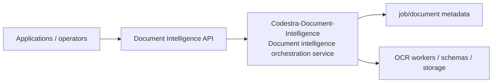
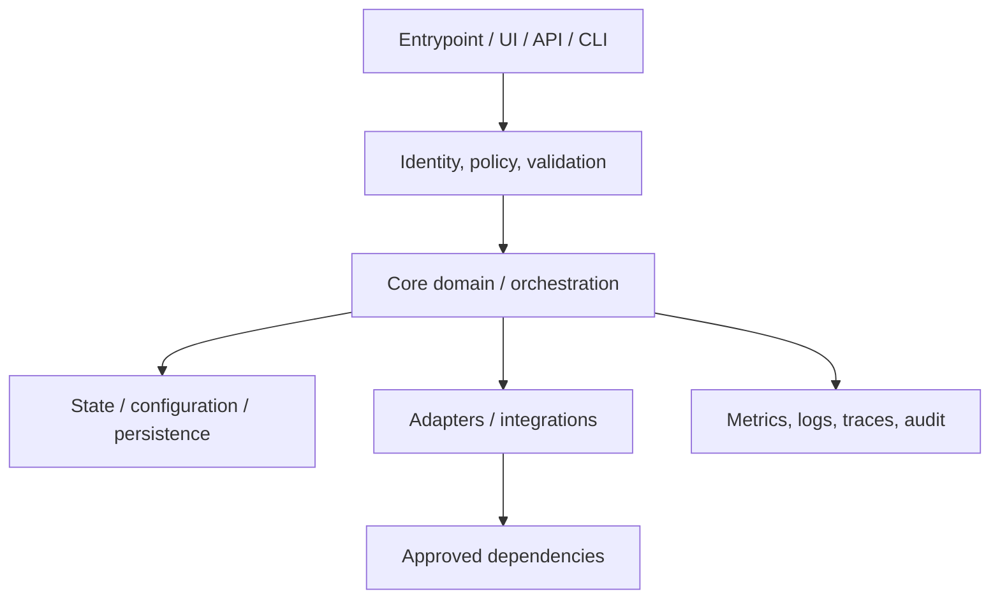
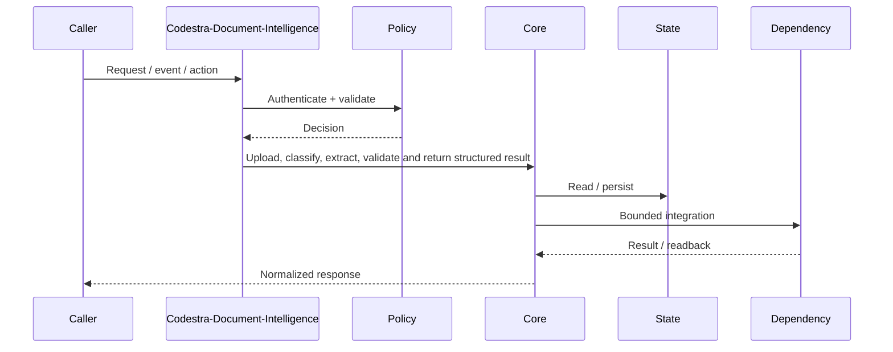
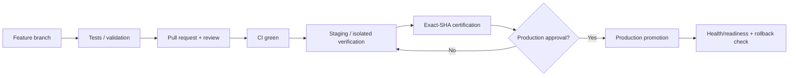
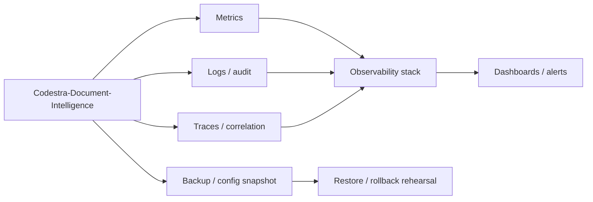

# Codestra-Document-Intelligence — Architecture Charts

> Repository: `appolon1908/Codestra-Document-Intelligence`  
> Baseline branch: `main`  
> Repository-local visual architecture. Update these diagrams when implementation or authority changes.

## 1. System context

## 2. Internal component architecture

## 3. Critical flow

## 4. Deployment and promotion

## 5. Observability and recovery

## Ownership notes
- **Role:** Document intelligence orchestration service
- **Primary boundary:** Document Intelligence API
- **State/config:** job/document metadata
- **Dependencies/consumers:** OCR workers / schemas / storage
- Cross-repository effects must use reviewed contracts; production effects remain separately gated.
